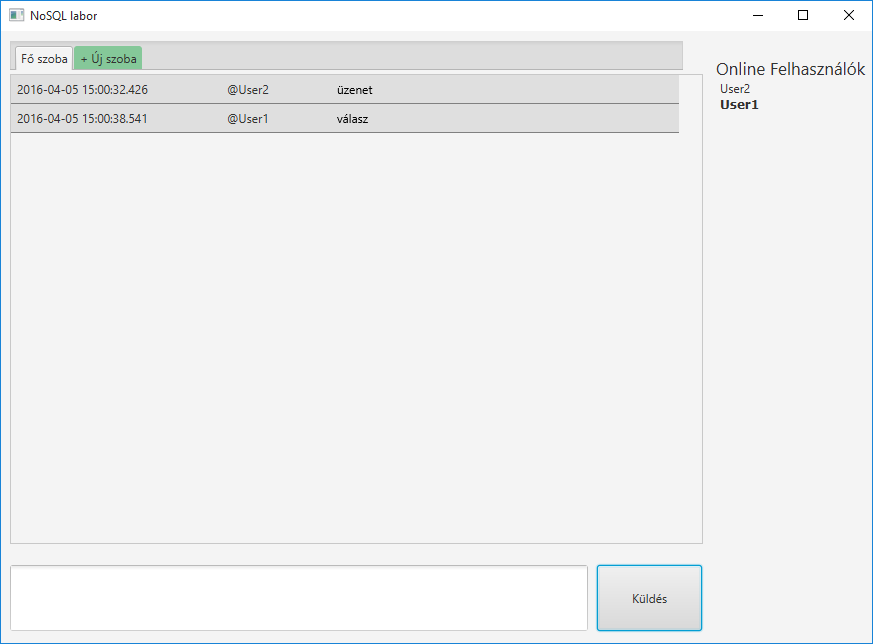
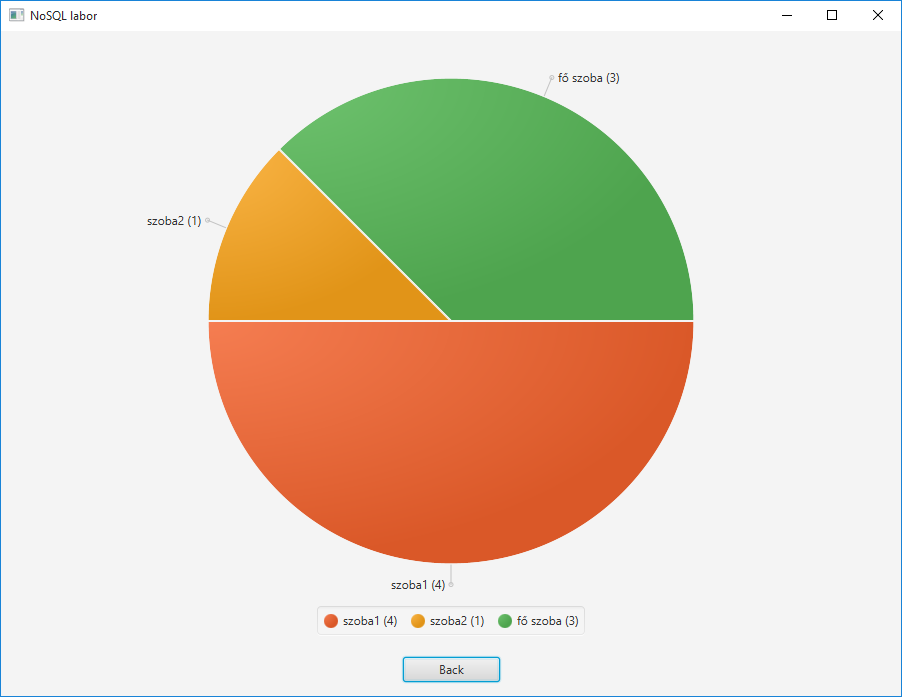
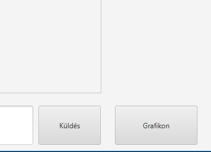

# Bevezetés

## Célkitűzés

Az előadással egybekötött gyakorlat célja, hogy bemutassuk a `NoSQL` (**N**ot **O**nly **SQL**) adatbázisok telepítését, használatát és különféle alkalmazásokba való integrációs lehetőségeit. A gyakorlat elvégzésével a hallgató képes lesz egy `NoSQL` alapú webes és asztali alkalmazás összeállítására, mely adatfogadásra és adat kiszolgálásra is alkalmas lehet adattárház és BI rendszerek irányába.

## NoSQL adatbázisok

### NoSQL vs. RDBMS


[forrás: http://www.monitis.com/blog/2011/05/22/picking-the-right-nosql-database-tool](http://www.monitis.com/blog/2011/05/22/picking-the-right-nosql-database-tool)

### Típusai:

1. Kulcs-érték alapú
 * **REDIS**, Voldemort, Riak
2. Oszlopos (vagy tabulált) adatbázis
 * Cassandra, HBase
3. Dokumentum alapú
 * MongoDb
4. Gráf alapú
 * Neo4J, InfoGrid, Infinite Graph
5. Objektum adatbázisok
 * OrientDB
 

## Előfeltételek

A gyakorlat elvégzéséhez nem szükséges külön Redis telepítése, azt a 91.134.196.66 címen biztosítunk. A Redis kipróbálására pedig lehetőség van az https://try.redis.io oldalon.

## REDIS

A REDIS egy rendkívül gyors, egyszerű kulcs-érték pár tároló, amely nagyrészt a memóriában dolgozva nagyon alacsony válaszidővel is képes rendelkezni. Ugyanakkor a perzisztencia is biztosított megkötésekkel, létezik snapshot szerű állapot mentés, illetve folyamatos írási napló alapú perzisztencia is. Ezekről bővebben itt lehet olvasni:

https://redis.io/topics/persistence

A REDIS cluster üzemmódot is támogat az új verzióban, így a skálázhatóság is biztosított.

### REDIS konzol kezelése

Próbáljuk ki a következő alap REDIS parancsokat néhány példa adaton.

REDIS-ben több adatbázisunk is lehet, melyek egy számmal vannak reprezentálva, az alapértelmezett a 0-s adatbázis.

Válasszuk ki az alapértelmezett adatbázist (nem kötelező):

```
SELECT 0
```
Illesszünk be egy értéket:

```
SET department AUT
```
Kérdezzük le a beillesztett értéket:

```
GET department
```
REDIS-ben az adatok elsőként a memóriába kerülnek tárolásra, de a REDIS gondoskodik a perzisztálásról/lemezre mentésről is (alapesetben másodpercenként), így a gyors és hosszú távú adattárolás is megoldott.

Lehetőség van azonban megadott ideig tárolni csak egy adatot. A következő paranccsal létrehozunk egy értéket, és beállítjuk, hogy csak 10 másodpercig legyen érvényes. A TTL parancs a hátralevő érvényességi idő kiírására szolgál:

```
SET department AUT
EXPIRE department 10
TTL department
```
Amennyiben mégis szeretnénk perzisztálni, akkor a PERSIST parancsot kell
használni:
```
PERSIST department
```
Ebben az esetben a TTL már -1 értéket ad vissza.

```
SCUBSCRIBE mychannel
PSUBSCRIBE my\*
PUBLUSH mychannel “test message”
```

#### List példa:

```shell
LPUSH mylist a # (integer) 1
LPUSH mylist b # (integer) 2
LPUSH mylist c # (integer) 3
LRANGE mylist 0 -1 # ”a”, “b”, “c”
LLEN mylist # (integer) 3
DEL mylist # (integer) 1
```
# Asztali REDIS Chat Alkalmazás Megvalósítása


## Project létrehozása




Következő feladatként készítsünk egy JavaFX alapú chat alkalmazást. Az alkalmazás használatához a felhasználóknak meg kell adni a nevüket, majd ezt követően különböző szobákat tud létrehozni, melyekbe üzeneteket írhatnak. Az üzenetek, az új szobák létrehozása, valamint az online felhasználók listája az alkalmazásban automatikusan megjelennek és frissülnek.

Első lépésként hozzunk létre WebStorm-ban egy Java projektet.

Ezután töltsük le a Redis eléréséhez a `Jedis` nevezetű Java osztálykönyvtárat az alábbi URL-ről:

[*http://search.maven.org/remotecontent?filepath=redis/clients/jedis/2.8.1/jedis-2.8.1.jar*](http://search.maven.org/remotecontent?filepath=redis/clients/jedis/2.8.1/jedis-2.8.1.jar)

A letöltött jar fájlt másoljuk be a projektünk alá, majd importáljuk be. Ezt a File/Project Structure/Libraries menüpont alatt tehetjük meg.

## 1. Adatbázis kapcsolat létrehozása


Hozzunk létre egy `chat` nevű package-t, abban pedig egy `ChatDBManager` Java osztályt, amely a Redis műveletekért lesz felelős. Az osztályt a Singleton tervezési minta alapján készítsük el és vegyük fel a csatlakozási paramétereket tartalmazó statikus property-ket:

```java
public class ChatDBManager {

    private static String REDIS_HOST = "91.134.196.66";
    private static Integer REDIS_DB = 1;


    public static ChatDBManager instance = null;

    protected ChatDBManager() {

    }

    public static ChatDBManager getInstance() {
        if (instance == null) {
            instance = new ChatDBManager();
        }
        return instance;
    }
}
```
Egészítsük ki az osztályt a Redis csatlakozást kezelő függvényekkel:

```java
private Jedis jedis = null;

public void connect() {
    jedis = new Jedis(REDIS_HOST);
    jedis.connect();
    jedis.select(REDIS_DB);
}

public void disconnect() {
    if (jedis != null) {
        jedis.disconnect();
    }
}
```

Hozzunk létre egy új metódust, ami a bejelentkezés után regisztrálja, kilépés után pedig törli a felhasználót a Redis adatbázisban. A jelenlévő felhasználók regisztrációja az online:*FELHASZNÁLÓ* kulcs létrehozásával történik.

```java
private String currentUser;

public void setCurrentUser(String currentUser) {
    this.currentUser = currentUser;
}

public String getCurrentUser() {
    return currentUser;
}

public void registerUser(String username) {
    jedis.set("online:" + username, "true");
    setCurrentUser(username);
}

public void unregisterCurrentUser() {
    jedis.del("online:" + getCurrentUser());
}
```

Hozzunk létre egy metódust a jelenlévő felhasználók lekéréséhez:

```java
public List<String> getOnlineUsers() {
    ScanParams params = new ScanParams();
    params.match("online:*");
    ScanResult<String> scanResult = jedis.scan("0", params);
    String nextCursor = scanResult.getStringCursor();
    boolean scanEnd = false;
    ArrayList<String> users = new ArrayList<>();
    while (!scanEnd) {
        for (String key : scanResult.getResult()) {
            users.add(key.replaceFirst("online:", ""));
        }
        scanResult = jedis.scan(nextCursor, params);
        nextCursor = scanResult.getStringCursor();
        if (nextCursor.equals("0")) {
            scanEnd = true;
        }
    }
    return users;
}
```


A metódus az `online:\*` minta alapján kigyűjti az adatbázisból a felhasználókat, majd visszatér azok listájával (levágva a kulcsokról az `online:` előtagot).

Ezek után készítsük el az üzenetek adatbázisba mentéséhez és lekéréséhez
szükséges metódusokat:

```java
public void sendMessage(String message) {
    String msg = (new Date()).getTime() + ":" + getCurrentUser() + ":" + message;
    jedis.rpush(getCurrentRoom() + ":messages", msg);
}

public List<String> getMessages() {
    return jedis.lrange(getCurrentRoom() + ":messages", 0, -1);
}
```

Az üzenetek Redis listákban tárolódnak, melyekbe rpush (right push) segítségével ”jobbról” szúrjuk be az új üzeneteket. A listák kulcsa tartalmazza a szoba nevét, amely így épül fel: `SZOBA:messages`. A szobákhoz tartozó listákban az üzenetek az alábbi módon tárolódnak:

```
IDŐBÉLYEG:FELHASZNÁLÓ:ÜZENET
```

Az üzeneteket lrange-el tudjuk kiolvasni a listákból, amit 0, -1
paraméterrel hívunk meg. Ez azt jelenti, hogy az összes listaelemet
lekérdezzük.

Következő lépésben hozzuk létre a szobákat kezelő metódusokat:

```java
public void addRoom(String roomName) {
    jedis.rpush("rooms", roomName);
}

public List<String> getRooms() {
    return jedis.lrange("rooms", 0, -1);
}

private String currentRoom = "main";

public void setCurrentRoom(String currentRoom) {
    this.currentRoom = currentRoom;
}

public String getCurrentRoom() {
    return currentRoom;
}

public Map<String,Long> getRoomsLength(){
	//TODO: implement
        return null;
}
```

Az üzenetekhez hasonlóan a szobák neveit is listában (`rooms`) tároljuk. Az aktuálisan megnyitott szoba nyilvántartását a `currentRoom` property-ben tároljuk.

## 2. Felület létrehozása

Készítsük el JavaFX alkalmazásunk belépési pontjaként szolgáló `Main` osztályt a `main` package-en belül:

```java
public class Main extends Application {

    @Override
    public void start(Stage primaryStage) throws Exception{
        Parent root = FXMLLoader.load(getClass().getResource("login.fxml"));
        primaryStage.setTitle("NoSQL labor");
        primaryStage.setScene(new Scene(root, 900, 600));
        primaryStage.show();
    }

    @Override
    public void stop(){
        ChatDBManager.getInstance().unregisterCurrentUser();
        ChatDBManager.getInstance().disconnect();
    }


    public static void main(String[] args) {
        launch(args);
    }
}
```

Ez az osztály két dologért felelős. Létrehozza a Scene-ünket a `login.fxml` alapján, valamint az ablak bezárása esetén a kilépteti a felhasználót és lezárja a kapcsolatot a Redis-el.

Készítsük el FXML-ben a bejelentkező képernyő felületét. Ehhez a `main`
package-en belül hozzuk létre a `login.fxml` nevű fájlt:

```fxml
<?xml version="1.0" encoding="UTF-8"?>
<?import javafx.scene.control.Button?>
<?import javafx.scene.control.Label?>
<?import javafx.scene.control.TextField?>
<?import javafx.scene.layout.GridPane?>
<GridPane alignment="center" hgap="10" vgap="10" xmlns:fx="http://javafx.com/fxml/1"
          xmlns="http://javafx.com/javafx/8" fx:controller="main.MainController">
    <children>
        <Label text="Felhasználói név:"/>
        <TextField fx:id="username" GridPane.columnIndex="1"/>
        <Button fx:id="loginBtn" text="Belépés" onAction="#btnSubmit" GridPane.columnIndex="2"/>
    </children>
</GridPane>
```

Hozzuk létre az FXML-ben hivatkozott `MainController` Java osztályt. Ez
az osztály felelős a felhasználói bejelentkezésért.

```java
public class MainController implements Initializable {

    @FXML
    private TextField username;


    @Override
    public void initialize(URL location, ResourceBundle resources) {
        ChatDBManager.getInstance().connect();
    }

    public void btnSubmit(ActionEvent actionEvent) throws IOException {
        if (!"".equals(username.getText())) {
            ChatDBManager.getInstance().registerUser(username.getText());
            Parent parent = FXMLLoader.load(getClass().getResource("/chat/chat.fxml"));
            Scene scene = new Scene(parent);
            Stage stage = (Stage) ((Node) actionEvent.getSource()).getScene().getWindow();
            stage.setScene(scene);
            stage.show();
        }
    }

}
```

A bejelentkezés gombra kattintáskor az FXML fájlban megadott btnSubmit
metódus fog lefutni, melyben beregisztráljuk a felhasználót Redis-ben, a
fentebb létrehozott registerUser metódus meghívásával. Ezután átváltunk
egy új `Scene`-re, melynek kinézetét a `chat.fxml` -ben definiáljuk.

Hozzuk létre a `chat.fxml` fájlt a `chat` package-en belül:

```fxml
<?xml version="1.0" encoding="UTF-8"?>
<?import javafx.scene.control.*?>
<?import javafx.scene.layout.AnchorPane?>
<?import javafx.scene.layout.VBox?>
<?import javafx.scene.text.Font?>
<AnchorPane maxHeight="-Infinity" maxWidth="-Infinity" minHeight="-Infinity" minWidth="-Infinity" prefHeight="665.0"
            prefWidth="900.0" xmlns="http://javafx.com/javafx/8" xmlns:fx="http://javafx.com/fxml/1"
            fx:controller="chat.ChatController">
    <children>
        <Label layoutX="715.0" layoutY="25.0" text="Online Felhasználók">
            <font>
                <Font size="17.0"/>
            </font>
        </Label>
        <VBox fx:id="online" layoutX="719.0" layoutY="49.0" prefHeight="481.0" prefWidth="163.0"/>
        <ScrollPane fx:id="messageScroll" layoutX="9.0" layoutY="43.0" prefHeight="470.0" prefWidth="693.0">
            <content>
                <VBox fx:id="messages" prefHeight="468.0" prefWidth="668.0"/>
            </content>
        </ScrollPane>
        <TabPane fx:id="roomsTabPane" layoutX="9.0" layoutY="10.0" prefHeight="481.0" prefWidth="673.0">
            <tabs>
                <Tab id="main" closable="false" text="Fő szoba"/>
                <Tab id="_newroom" closable="false" style="-fx-background-color: #85C899;" text="+ Új szoba">
                    <content>
                        <AnchorPane minHeight="0.0" minWidth="0.0" prefHeight="503.0" prefWidth="485.0">
                            <children>
                                <TextField fx:id="roomName" layoutX="261.0" layoutY="242.0"/>
                                <Label layoutX="170.0" layoutY="247.0" text="Szoba neve:"/>
                                <Button layoutX="449.0" layoutY="242.0"
                                        onAction="#addRoomAction" text="Létrehoz"/>
                            </children>
                        </AnchorPane>
                    </content>
                </Tab>
            </tabs>
        </TabPane>
        <TextArea fx:id="message" layoutX="9.0" layoutY="534.0" prefHeight="66.0" prefWidth="578.0"/>
        <Button fx:id="sendBtn" layoutX="596.0" layoutY="534.0" onAction="#sendAction"
                prefHeight="66.0" prefWidth="105.0" text="Küldés"/>
    </children>
</AnchorPane>
```

Hozzuk létre az fxml fájlhoz tartozó kontroller osztályt `ChatController` néven és `@FXML` annotációval hozzunk létre hivatkozást az egyes nézet elemekre.

```java
public class ChatController implements Initializable {

    @FXML
    private VBox online;

    @FXML
    private TextArea message;

    @FXML
    private ScrollPane messageScroll;

    @FXML
    private TextField roomName;

    @FXML
    private TabPane roomsTabPane;

    @FXML
    private VBox messages;

    @Override
    public void initialize(URL location, ResourceBundle resources) {
        loadOnlineUsers();
        loadRooms();
        loadMessages();
        roomsTabPane.getSelectionModel().selectedItemProperty().addListener(new ChangeListener<Tab>() {
            @Override
            public void changed(ObservableValue<? extends Tab> observableValue, Tab tab, Tab changedTab) {
                ChatDBManager.getInstance().setCurrentRoom(changedTab.getId());
                loadMessages();
            }
        });
    }
}
```

A nézet betöltődése után az `initialize` metódus fog automatikusan meghívódni. Ebben inicializáljuk az egyes felületi elemek tartalmát (jelenlévő felhasználók listája, szobák listája, üzenetek). A szobák listáját Tab-ok formájában jelenítjük meg. Ha a felhasználó rákattint az egyik tab-ra, akkor átállítjuk az aktuális szobát, majd újratöltjük az üzenetek listáját, hogy az aktuális szobához tartozóak jelenjenek meg. Ehhez beregisztrálunk egy `listener` függvényt, ahol ezeket a műveleteket lekezeljük.

Készítsük el az initialize metódusban hivatkozott további inicializáló
függvényeket:

```java
private void loadOnlineUsers() {
    online.getChildren().clear();
    List<String> onlineUsers = ChatDBManager.getInstance().getOnlineUsers();
    for (String onlineUser : onlineUsers) {
        Label user = new Label(onlineUser);
        if (onlineUser.equals(ChatDBManager.getInstance().getCurrentUser())) {
            user.setFont(Font.font("Verdana", FontWeight.BOLD, 12));
        }
        online.getChildren().add(user);
    }
}

private void addMessage(String msg) {
    String[] msgParts = msg.split(":", 3);
    Label date = new Label(new Timestamp(Long.parseLong(msgParts[0])).toString());
    date.setId("date");
    date.setPrefWidth(200);
    Label user = new Label("@" + msgParts[1]);
    user.setPrefWidth(100);
    HBox hBox = new HBox();
    hBox.getChildren().add(date);
    hBox.getChildren().add(user);
    hBox.getChildren().add(new Text(msgParts[2]));
    hBox.setPrefHeight(20);
    hBox.setSpacing(10);
    hBox.setPadding(new Insets(5, 5, 5, 5));
    hBox.setStyle("-fx-background-color: #DFDFDF; -fx-border-color:  transparent transparent gray transparent");
    messages.getChildren().add(hBox);
    messageScroll.setVvalue(1.0);
}

private void addRoom(String room) {
    Tab tab = new Tab(room);
    tab.setId(room);
    VBox messagesVBox = new VBox();
    messagesVBox.setId("messages");
    tab.setContent(messagesVBox);
    roomsTabPane.getTabs().add(tab);
}

private void loadRooms() {
    List<String> rooms = ChatDBManager.getInstance().getRooms();
    for (String room : rooms) {
        addRoom(room);
    }
}

private void loadMessages() {
    messages.getChildren().clear();
    List<String> messages = ChatDBManager.getInstance().getMessages();
    for (String message : messages) {
        addMessage(message);
    }
}
```

Következő lépésben hozzuk létre az üzenet küldés és a szoba létrehozás gombhoz tartozó akció metódusokat:

```java
public void sendAction(ActionEvent actionEvent) {
    if (!"".equals(message.getText())) {
        ChatDBManager.getInstance().sendMessage(message.getText());
        message.setText("");
    }
}

public void addRoomAction(ActionEvent actionEvent) {
    if (!"".equals(roomName.getText())) {
        ChatDBManager.getInstance().addRoom(roomName.getText());
        ChatDBManager.getInstance().setCurrentRoom(roomName.getText());
        roomName.setText("");
    }
}
```

## 3. Publish-Subscribe megvalósítása

Alkalmazásunk ezek után már működőképes, csak nem szinkronizálja más felhasználók tevékenységeit. Nem jelennek meg automatikusan az alkalmazás indítása óta küldött új üzenetek, bejelentkezett új felhasználók és a létrehozott új szobák (csak újraindítás után). Következő lépésekben ezt fogjuk implementálni a Redis Publish/Subscribe módszer alkalmazásával. Ennek lényege, hogy különböző csatornákra üzenetet küldünk, melyeket minden feliratkozott kliens megkap.

Először is egészítsük ki `ChatDBManager` osztályunkat, hogy kezelni tudja a csatornákra való feliratkozást és az azokon érkező üzenetek fogadását:

```java
public void subscribe(String channel, JedisPubSub listener) {
    Thread thread = new Thread(new JedisTask(listener, channel));
    thread.setDaemon(true);
    thread.start();
}

private static class JedisTask implements Runnable {

    Jedis jedis = null;
    JedisPubSub channelListener;
    String channel;

    JedisTask(JedisPubSub listener, String channel) {
        this.channelListener = listener;
        this.channel = channel;
        this.jedis = new Jedis(REDIS_HOST);
        jedis.connect();
        jedis.select(REDIS_DB);
    }

    @Override
    public void run() {
        try {
            jedis.psubscribe(channelListener, channel);
            while (true) {
                Thread.sleep(200);
            }
        } catch(InterruptedException e) {
            e.printStackTrace();
        }
    }
}
```

Csatornákra feliratkozni későbbiekben a létrehozott `subscribe` metóduson keresztül tudunk, ami egy külön szálon felcsatlakozik a Redis-re a JedisTask subclass segítségével, majd a csatornákon érkező üzeneteket egy átadott listener segítségével tudjuk lekezelni.

Ezek után egészítsük ki az említett műveleteket, hogy egy csatornán jelezzék a feliratozott klienseknek.

Először a felhasználók regisztrációiról küldjünk a `users:reload` csatornán egy üzenetet, annak érdekében, hogy jelezzük, hogy a kliensalkalmazásokban újra kell tölteni az online felhasználók listáját. Ehhez a `registerUser` és az `uregisterCurrentUser` metódosunkba vegyünk fel egy publish metódushívást (a változtatás vastagon van jelölve):

```java
public void registerUser(String username) {
    jedis.set("online:" + username, "true");
    setCurrentUser(username);
*    jedis.publish("users:reload", "");
}

public void unregisterCurrentUser() {
    jedis.del("online:" + getCurrentUser());
*    jedis.publish("users:reload", "");
}
```

A csatornán küldött üzenet tartalma üres string, mivel azt jelen esetben nem kezeljük le (bármi lehet).

Ezután egészítsük ki publish hívással a `sendMessage` és `addRoom` metódusokat is.

```java
public void sendMessage(String message) {
    String msg = (new Date()).getTime() + ":" + getCurrentUser() + ":" + message;
    jedis.rpush(getCurrentRoom() + ":messages", msg);
    jedis.publish("room:" + getCurrentRoom() + ":message", msg);
}

public void addRoom(String roomName) {
    jedis.rpush("rooms", roomName);
    jedis.publish("rooms:new", roomName);
}
```

Ebben a két esetben a publish üzenet tartalma már nem üres string, hanem a küldött chat üzenet, valamint a szoba neve.
Végül nem maradt más hátra, mint ezekre a csatornákra való feliratkozás. Térjünk vissza a `ChatController` osztályunkhoz, majd egészítsük ki az initialize() függvényünket egy subscribeToRedisChannels() hívással:

```java
@Override
public void initialize(URL location, ResourceBundle resources) {
    loadOnlineUsers();
    loadRooms();
    loadMessages();
    roomsTabPane.getSelectionModel().selectedItemProperty().addListener(new ChangeListener<Tab>() {
        @Override
        public void changed(ObservableValue<? extends Tab> observableValue, Tab tab, Tab t1) {
            ChatDBManager.getInstance().setCurrentRoom(t1.getId());
            loadMessages();
        }
    });
    subscribeToRedisChannels();
}
```


A `subscribeToRedisChannels` tartalma pedig a következő lesz:

```java
private void subscribeToRedisChannels() {
    ChatDBManager.getInstance().subscribe("users:reload", new JedisPubSub() {
        @Override
        public void onPMessage(String pattern, String channel, String room) {
            Platform.runLater(new Runnable() {
                @Override
                public void run() {
                    loadOnlineUsers();
                }
            });
        }
    });
    ChatDBManager.getInstance().subscribe("room:*:message", new JedisPubSub() {
        @Override
        public void onPMessage(String pattern, String channel, String message) {
            Platform.runLater(new Runnable() {
                @Override
                public void run() {
                    String roomName = channel.split(":")[1];
                    if (roomName.equals(ChatDBManager.getInstance().getCurrentRoom())) {
                        addMessage(message);
                        messageScroll.setVvalue(1.0);
                    }
                }
            });
        }
    });
    ChatDBManager.getInstance().subscribe("rooms:new", new JedisPubSub() {
        @Override
        public void onPMessage(String pattern, String channel, String room) {
            Platform.runLater(new Runnable() {
                @Override
                public void run() {
                    addRoom(room);
                    if (room.equals(ChatDBManager.getInstance().getCurrentRoom())) {
                        roomsTabPane.getSelectionModel().selectLast();
                    }
                }
            });
        }
    });
}
```

Első esetben a users:reload csatornára iratkozunk fel, ahol ha üzenet érkezik akkor a loadOnlineUsers metódusunk meghívásával újratöltjük az online felhasználók listáját. A Platform.runLater hívásra azért van szükség, mert a csatornákon az üzenetek külön szálon érkeznek és ennek segítségével tudunk a JavaFX szálunkon módosítani a megjelenített elemeken.

A következő feliratkozás a `room:*:message` mintára illeszkedő csatornákra történik. Itt a `*` segítségével illesztünk a különböző szoba nevekre, amit később visszanyerünk a csatorna nevéből a `:` elválasztó mentén felbontva azt. Ezután ellenőrizzük, hogy az aktuálisan érkezett chat üzenet ugyanabban a szobában jött-e, mint ahol jelenleg vagyunk. Ha
igen, akkor hozzáadjuk azt az üzenetet listához (a teljes újratöltés nélkül).

Végül feliratkozunk a `rooms:new` csatornára is, ahol lekezeljük az
újonnan keletkezett szobák felvételét is.

# Önálló feladatok

## 4. Szoba nevek kiemelése

Valósítsa meg, hogy ha egy olyan szobába jön üzenet, ami jelenleg nem aktív, akkor a szoba neve vastagon legyen jelölve.

**Figyelem:** a fő szobára is működjön megfelelően.

**Tipp**: ne szövegre, hanem id-ra vizsgáld a szobanevet.

Egészítse ki az előző feladatot úgy, hogy ha rákattintunk egy vastagon
jelölt szoba nevére, akkor az váltson vissza nem vastagra

**Figyelem:** az új szoba tab háttere maradjon zöld!

## 5. Grafikon kirajzolás szobák statisztikájáról:



Valósítson meg egy új képernyőt, amely egy kördiagrammon ábrázolja az egyes szobákba érkezett üzeneteket számát. Képernyőn jelenjen meg egy jelmagyarázat és egy vissza gomb is, mellyel az előző nézetre lehet visszanavigálni. Valamint a szobanevek után zárójelben jelenjen meg az üzenetek száma.

Lépések:

1.  Új gomb felvétel a képernyőn
    * 
2.  `ChatDBManager` `getRoomsLength()` függvény implementálása
3.  Grafikon kirajzoló felület (fxml) és kontroller létrehozása
    *  PieChart példa: [*http://docs.oracle.com/javafx/2/charts/pie-chart.htm\#CIHFDADD*](http://docs.oracle.com/javafx/2/charts/pie-chart.htm#CIHFDADD)
4.  Vissza gomb létrehozása

## Bónusz feladat:

Grafikon folyamatosan frissüljön új üzenet érkezésekor.
